# TestTask
Тестовое задание для компании "Гуд технологии".
## Описание
* Тестовое задание для компании "Гуд технологии".
* Ссылка на домен https://laravel-b8vz.frb.io/. 
* Приложение включает : (Авторизацию + Регистрацию), две роли : Пользователь и Менеджер, форма обратной связи, страницу со списком заявок на обюратную связь и отправкой email на почту Менеджера.
# Авторизация и регистрация
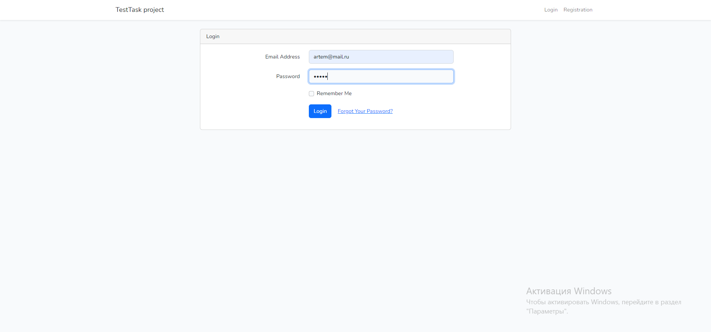
# Админ панель для роли "Админ"
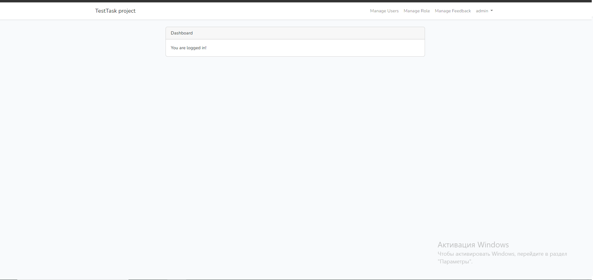
# Админ панель для управления пользователями
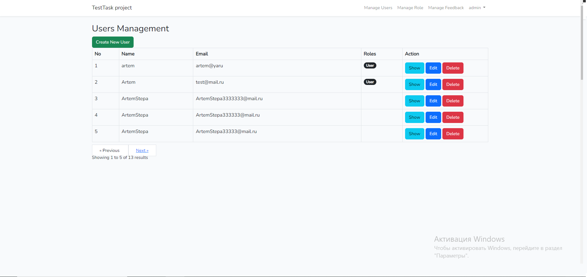
# Админ панель для управления ролями пользователей
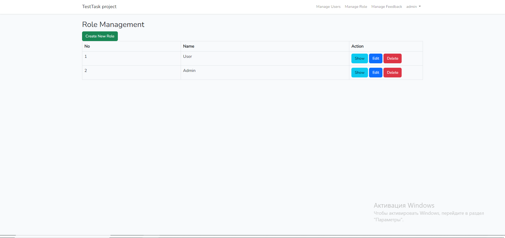
# Админ панель для управления отзывами
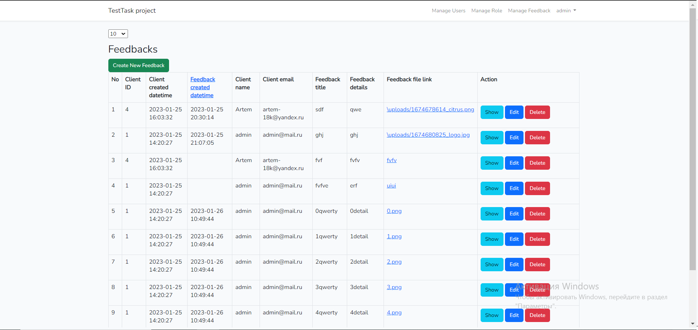
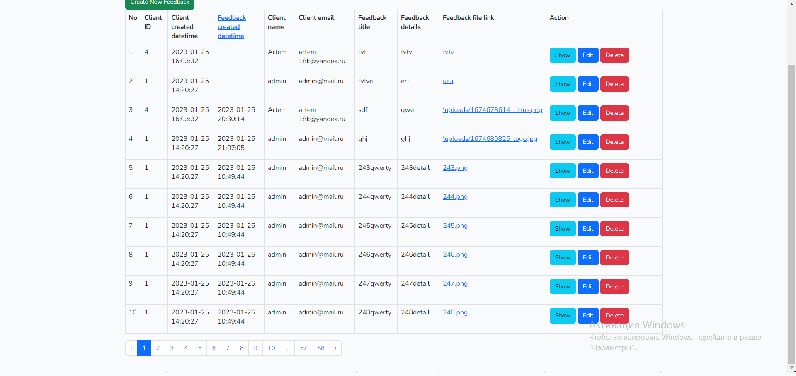
# Создание нового пользователя
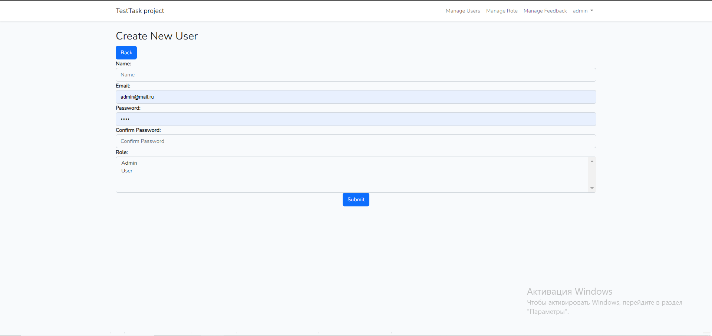
# Создание новой роли
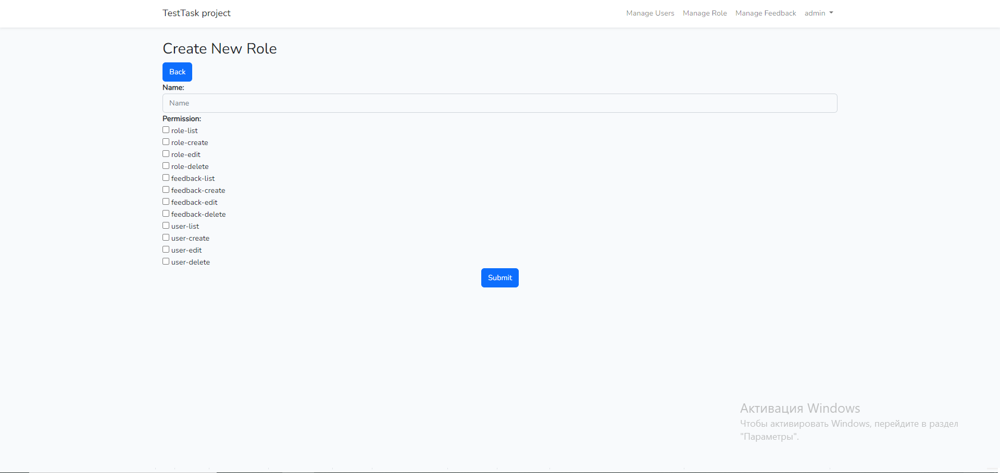
# Создание нового отзыва
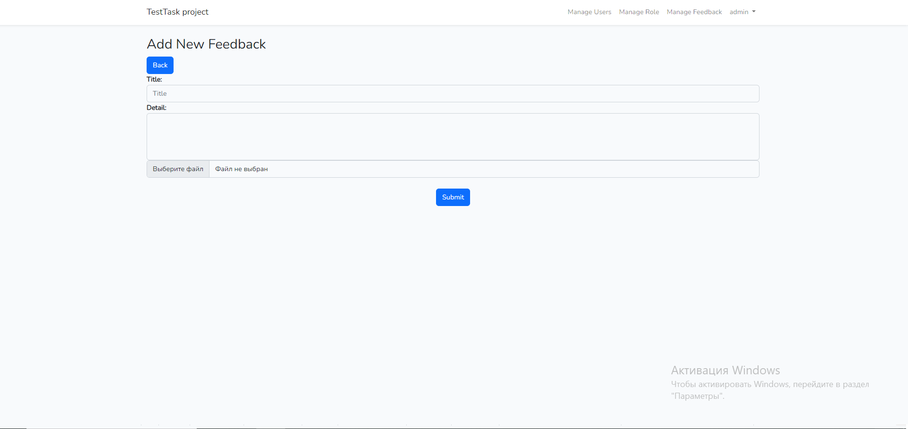
# Панель для роли "Пользотваель"
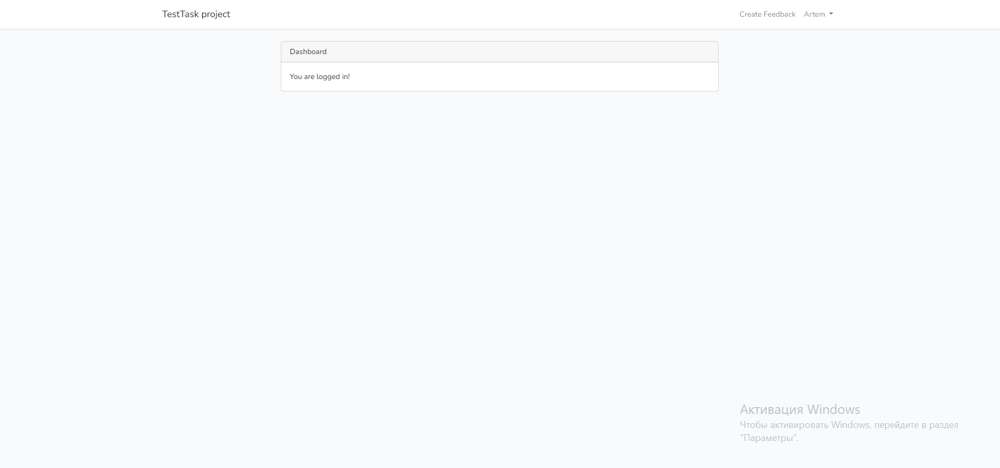
# Панель для роли "Пользотваель" для создания отзыва
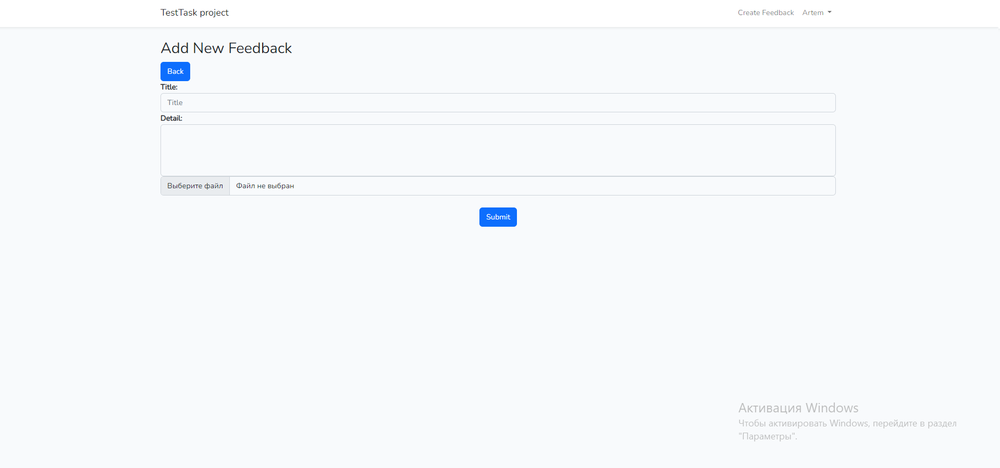
# Logout

